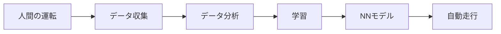

# ニューラルネットワークでルールを学習しよう

ルールベースで制御していた超音波センサーの値を入力とし、コントローラからの操作値を教師データとして模倣学習するニューラルネットワークでの走行を実施します。

## 概要



---

## 利用可能なモデル一覧

用途に応じて複数のモデルから選択できます：

| モデル名 | 入力データ | 特徴 | 学習時間 | 推論速度 | おすすめ度 |
|---------|----------|------|---------|---------|-----------|
| **donkeycar** | 画像 | 軽量CNN、バランス型 | 中 | 速い | ★★★★★ |
| **nn** | センサー値 | 全結合NN、シンプル | 短 | 非常に速い | ★★★☆☆ |
| **resnet18** | 画像 | 高精度、事前学習済み | 長 | 中 | ★★★★☆ |
| **mobilevit_xxs** | 画像 | Vision Transformer | 中 | 中 | ★★★☆☆ |
| **edgenext_xxsmall** | 画像 | エッジ最適化 | 中 | 速い | ★★★★☆ |

### モデル詳細

#### donkeycar（軽量CNN）- おすすめ

DonkeyCarプロジェクトの軽量畳み込みニューラルネットワーク。

```
入力画像(224x224x3) → Conv2D×3 → 全結合層 → 出力(steering, throttle)
```

- ✅ 軽量で高速（約600 FPS）
- ✅ 学習時間が短い（30エポックで約10-20分）
- ✅ Raspberry Piでも動作可能
- ✅ 初心者に最適

#### nn（ニューラルネットワーク）

超音波センサー/LiDARの距離データから操作を学習。画像を使わないシンプルなモデル。

```
センサー入力(5値) → 全結合層×3 → 出力(steering, throttle)
```

- ✅ 非常に軽量（数KB）
- ✅ 学習が高速（10エポックで数分）
- ✅ カメラ不要
- ⚠️ 画像モデルより精度は劣る

#### resnet18（ResNet18）

ImageNetで事前学習済みのモデルを転移学習。

- ✅ 高精度（複雑なコースに強い）
- ✅ 少ないデータでも学習可能
- ⚠️ 学習時間が長い（30エポックで30-60分）
- ⚠️ モデルサイズが大きい（約45MB）

#### mobilevit_xxs / edgenext_xxsmall

最新のエッジAI向けアーキテクチャ。TensorRT最適化で高速化。

- ✅ TensorRT最適化で3.9〜5.15倍高速化
- ✅ Jetsonで最高性能
- ⚠️ PyTorchのままだと遅い

### モデル選択ガイド

| 状況 | おすすめモデル |
|-----|--------------|
| **初心者・ハンズオン** | donkeycar |
| **センサーのみで試したい** | nn |
| **高精度を目指す** | resnet18, edgenext_xxsmall |
| **Jetson + TensorRT** | edgenext_xxsmall |

### 推論速度の比較（Jetson Orin Nano + TensorRT）

| モデル | 推論時間 | FPS | 速度向上 |
|-------|---------|-----|---------|
| donkeycar | 1.65ms | 606 | 1.26x |
| edgenext_xxsmall | 4.42ms | 226 | 5.15x |
| resnet18 | 4.89ms | 204 | 2.12x |
| mobilevit_xxs | 7.43ms | 134 | 3.92x |

---

## config.py設定

```python
# NNパラメータ
HAVE_NN = True

## 学習済みモデルのパス
model_dir = "models"
model_name = "model_20240709_record_20240624_023159.csv_epoch_30_uls_RrLH_FrLH_Fr_FrRH_RrRH.pth"
model_path = os.path.join(model_dir, model_name)

## モデルと学習のハイパーパラメータ設定
hidden_dim = 64       # 隠れ層のノード数
num_hidden_layers = 3 # 隠れ層の数
batch_size = 8
```

---

## 学習手順

### ステップ1: データ収集

マニュアルモードで走行し、操作データを記録：

```bash
python run.py
```

- Yボタン（または設定したキー）で記録開始/停止
- できるだけ多くのパターンを収集

### ステップ2: 学習実行

```bash
python train_pytorch.py
```

### ステップ3: 推論実行

```python
# config.py
PLAN = "nn"
```

```bash
python run.py
```

---

## train_pytorch.pyの使用方法

### 基本的な使い方

```bash
# config.pyの設定に基づいて自動的に学習を実行
python train_pytorch.py
```

### 主な機能

1. **自動データ読み込み**: CSV形式またはDonkeycar形式を自動判別
2. **モデル自動選択**: config.pyのPLAN設定に基づいてモデルを選択
3. **継続学習対応**: 既存モデルからの学習再開が可能
4. **データ拡張**: 自動的にデータオーグメンテーションを適用
5. **Early Stopping**: 過学習を防ぐための早期停止機能
6. **モデル変換提案**: JetsonならTensorRT、Raspberry PiならOpenVINOへの変換を提案
7. **超音波センサー正規化**: 距離値を0〜1の範囲に正規化

### 学習の流れ

1. データディレクトリが自動選択（最新のデータセット）
2. 設定内容の確認プロンプトが表示
3. 継続学習の場合は既存モデルの読み込み確認
4. 学習実行（進捗とロスが表示）
5. モデル保存
6. デバイスに応じてTensorRT/OpenVINO変換を提案

---

## 利用可能なモデル

| モデル | 説明 | 入力 | 用途 |
|--------|------|------|------|
| `nn` | 超音波センサー用NN | 超音波センサー値 | 基本的な学習ベース制御 |
| `donkeycar` | 軽量CNN | カメラ画像 | 高速画像認識制御 |
| `resnet18` | ResNet18 | カメラ画像 | 高精度画像認識 |
| `mobilevit_xxs` | MobileViT XXS | カメラ画像 | モバイル向け |
| `edgenext_xxsmall` | EdgeNeXt XXSmall | カメラ画像 | エッジデバイス最適化 |

---

## config.pyの重要な設定

```python
# 使用するモデルプラン
PLAN = "donkeycar"  # "nn", "donkeycar", "resnet18", etc.

# データ形式
SAVE_FORMAT = "donkeycar"  # "csv" または "donkeycar"

# 学習パラメータ
EPOCHS = 5
BATCH_SIZE = 8

# モデル保存先
MODEL_DIR = "models"
MODEL_NAME = "my_model.pth"  # 継続学習する場合は既存モデル名を指定

# 推論エンジン（学習時はpytorch、推論時に変更可能）
INFERENCE_ENGINE = "pytorch"  # "tensorrt", "openvino"

# 超音波センサー正規化
NORMALIZE_RANGE = 2000  # 2000mm → 1.0
```

---

## カメラデータのアノテーションと学習

カメラを使った画像認識モデルの学習には、以下の手順を推奨します：

### 1. データ収集

```python
# config.py
SAVE_FORMAT = "donkeycar"  # Donkeycarフォーマットで保存
```

### 2. データ分析・学習ツール

#### data_viewer（推奨）

[data_viewer](https://github.com/Romihi/data_viewer)は、走行データの可視化・分析・学習を行うWebベースツールです。

**インストール:**

```bash
# リポジトリをクローン
git clone https://github.com/Romihi/data_viewer.git
cd data_viewer

# 依存パッケージをインストール
pip install -r requirements.txt
```

**起動方法:**

```bash
python app.py
# または
./run.sh
```

ブラウザで `http://localhost:5000` にアクセス

**主な機能:**

| 機能 | 説明 |
|------|------|
| **データ可視化** | Chart.jsによるインタラクティブなタイムラインチャート |
| **ヒストグラム** | ステアリング・スロットルのデータ分布をリアルタイム表示 |
| **統計パネル** | 平均、標準偏差、最小/最大値、四分位数を自動計算 |
| **画像確認** | 複数カメラ画像の同時表示、スライダーで任意フレームを確認 |
| **データ処理** | 正規化（-1〜1）、移動平均（MA）、指数移動平均（EMA）による平滑化 |
| **削除管理** | 不良データの範囲選択と削除インデックス管理 |
| **学習機能** | ニューラルネットワークの学習を実行 |

**UI構成:**

```
┌─────────────────────────────────────────────┐
│  Images Panel    │  Timeline Panel          │
│  (カメラ画像)     │  (時系列グラフ)           │
├─────────────────────────────────────────────┤
│  Statistics      │  Histogram               │
│  (統計情報)       │  (データ分布)             │
└─────────────────────────────────────────────┘
```

**再生コントロール:**

- ステップ操作（前後フレーム移動）
- 順方向/逆方向再生
- 1〜10倍速度調整
- インデックススライダーで直接移動

**削除インデックス管理:**

1. 開始・終了インデックスを設定
2. 不良データ範囲をマーク
3. マニフェストに永続保存

これにより、学習に使用しないデータ（クラッシュ時、手で修正した時など）を除外できます。

#### annotation_training_d2j（発展）

[annotation_training_d2j](https://github.com/Romihi/annotation_training_d2j)は、より高度なデータ処理を行うツールです：

- データアノテーション（ラベル付け）
- データ拡張（回転、明度変更など）
- 位置推論モデルの学習

---

## 実習課題

### 課題1: 超音波センサーNNの学習

1. マニュアルモードで周回コースを10周走行
2. 収集したデータで学習
3. `nn`モードで自動走行を試す
4. 結果を評価

### 課題2: 異なるハイパーパラメータの比較

| 設定 | hidden_dim | num_hidden_layers | 結果 |
|-----|------------|-------------------|------|
| A | 32 | 2 | |
| B | 64 | 3 | |
| C | 128 | 4 | |

### 課題3: データ量と精度の関係

1. 5周分のデータで学習
2. 10周分のデータで学習
3. 20周分のデータで学習
4. それぞれの走行精度を比較

---

## トラブルシューティング

### モデルが学習しない

- データ量が少なすぎる可能性
- 学習率が適切か確認
- データにノイズが多い場合はフィルタリング

### 推論時に異常動作

- 学習データと推論時の環境が異なる可能性
- センサーのキャリブレーションを確認
- モデルが過学習している可能性

### GPUメモリ不足

- `BATCH_SIZE`を小さくする
- モデルを軽量なものに変更
