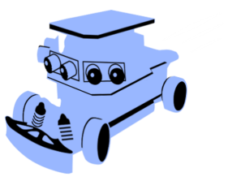
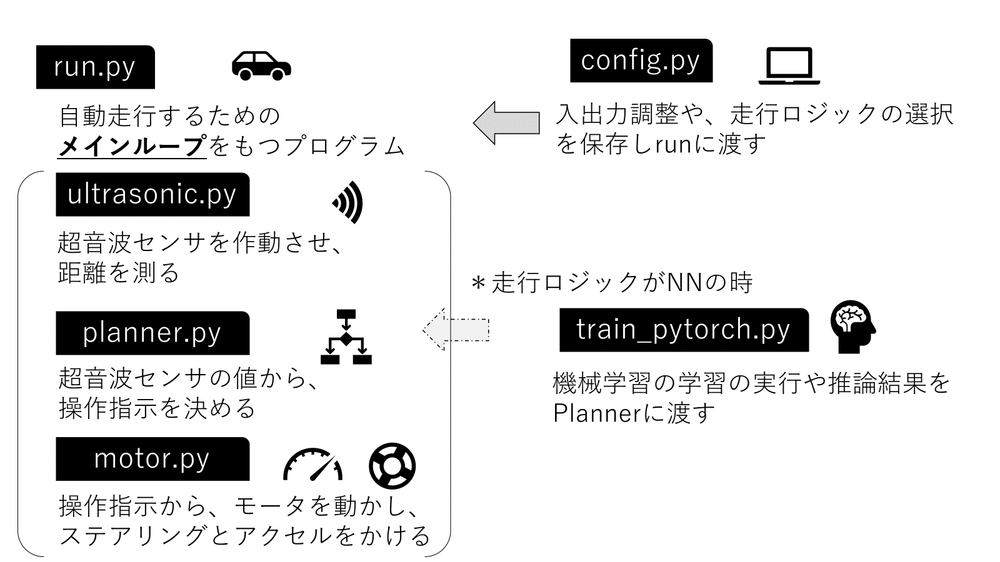
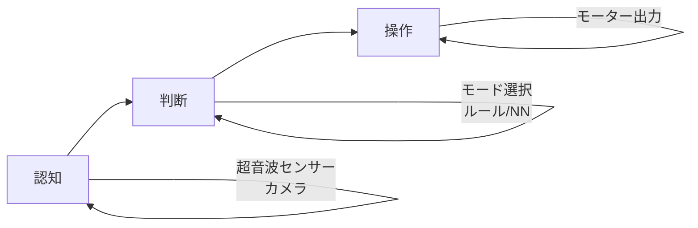

# togikaidrive

## ***Mobility for All to Study!***

超音波センサ等で自動運転するミニカーの制御プログラム。
自動運転ミニカーバトルと出前授業等で活用。



## 主なプログラム概要

`python run.py` で走行！

| プログラム名 | 説明 |
| ------------ | ---- |
| run.py | 走行時のループ処理をするメインプログラム |
| config.py | パラメータ用プログラム（デバイス自動検出機能付き） |
| ultrasonic.py | 超音波測定用プログラム（RPi4/5/Jetson自動対応） |
| planner.py | 走行ロジック用プログラム |
| motor.py | 操舵・モーター出力/調整用プログラム |
| train_pytorch.py | 機械学習用プログラム |

!!! note "画像認識モデルについて"
    画像入力を使ったCNNモデルによる推論には[annotation_training_d2j](https://github.com/Romihi/annotation_training_d2j)の統合が必要です。



## 自動運転の流れ



## クイックスタート

### 1. センサー確認
```bash
python ultrasonic.py
```

### 2. モーター調整
```bash
python motor.py
```

### 3. 走行開始
```bash
python run.py
```

## 講座の進め方

1. **[基本確認](basics/sensors.md)** - センサー・モーター・コントローラの動作確認
2. **[認知](lesson/recognition.md)** - 超音波センサーの仕組みを理解
3. **[判断](lesson/decision.md)** - 走行モードとアルゴリズムを学ぶ
4. **[操作](lesson/control.md)** - モーター制御の基本を習得
5. **[演習](exercises/chicken-race.md)** - 実践的な課題に挑戦

## リンク

- [GitHub リポジトリ](https://github.com/autonomous-minicar-battle/togikaidrive-dev)
- [annotation_training_d2j](https://github.com/Romihi/annotation_training_d2j) - 画像アノテーション・学習ツール
