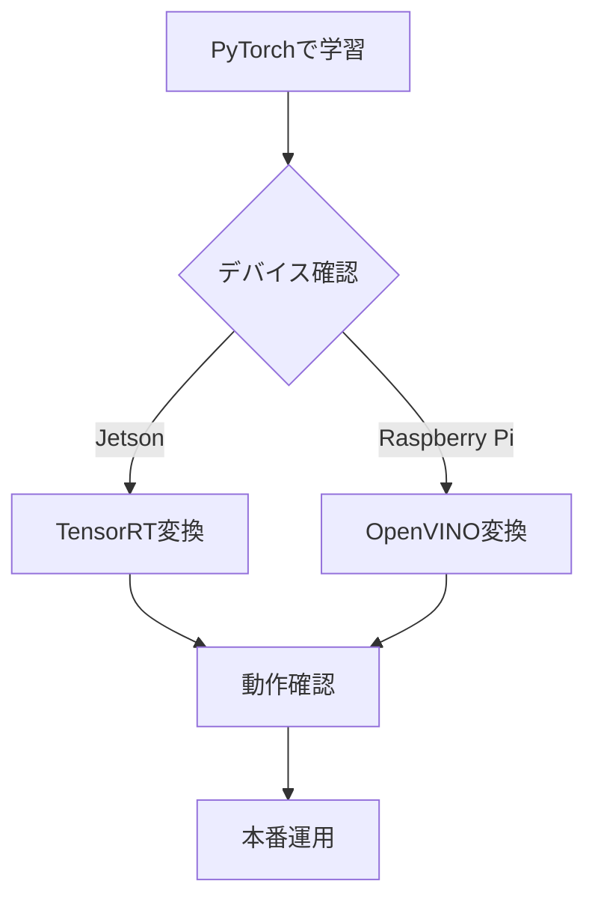

# TensorRT / OpenVINO 推論

学習済みモデルを高速化するための推論エンジンについて解説します。

## 概要

| エンジン | 対象デバイス | 特徴 |
|---------|-------------|------|
| PyTorch | 全デバイス | 開発・デバッグ向け |
| TensorRT | Jetson | NVIDIA GPU最適化 |
| OpenVINO | Raspberry Pi | Intel CPU最適化 |

## config.py設定

```python
# 推論エンジン選択
INFERENCE_ENGINE = "pytorch"  # "tensorrt", "openvino"
```

---

## TensorRT（Jetson向け）

### 変換手順

```bash
# 学習後に自動で提案される、または手動で実行
python convert_tensorrt.py --model models/my_model.pth
```

### 変換オプション

```python
# config.py
TENSORRT_FP16 = True         # FP16精度（高速化）
TENSORRT_BATCH_SIZE = 1      # バッチサイズ
TENSORRT_WORKSPACE = 1 << 30 # ワークスペースサイズ(1GB)
```

### 出力ファイル

```
models/
├── my_model.pth           # 元のPyTorchモデル
└── my_model_trt.engine    # TensorRTエンジン
```

### ベンチマーク結果（参考）

| モデル | PyTorch | TensorRT | 高速化率 |
|--------|---------|----------|---------|
| donkeycar | 15ms | 3ms | 5x |
| resnet18 | 45ms | 8ms | 5.6x |
| mobilevit_xxs | 25ms | 5ms | 5x |

---

## OpenVINO（Raspberry Pi向け）

### インストール

```bash
pip install openvino-dev
```

### 変換手順

```bash
# ONNX経由で変換
python convert_openvino.py --model models/my_model.pth
```

### 変換の流れ

```
PyTorch (.pth)
    ↓
ONNX (.onnx)
    ↓
OpenVINO IR (.xml + .bin)
```

### 出力ファイル

```
models/
├── my_model.pth           # 元のPyTorchモデル
├── my_model.onnx          # ONNX中間形式
├── my_model.xml           # OpenVINOモデル定義
└── my_model.bin           # OpenVINO重み
```

### ベンチマーク結果（参考）

| モデル | PyTorch | OpenVINO | 高速化率 |
|--------|---------|----------|---------|
| donkeycar | 80ms | 25ms | 3.2x |
| resnet18 | 250ms | 70ms | 3.6x |

---

## 使用方法

### TensorRT

```python
# config.py
INFERENCE_ENGINE = "tensorrt"
MODEL_NAME = "my_model_trt.engine"
```

### OpenVINO

```python
# config.py
INFERENCE_ENGINE = "openvino"
MODEL_NAME = "my_model.xml"
```

---

## トラブルシューティング

### TensorRT変換エラー

```
Error: CUDA out of memory
```

**対策:**
- `TENSORRT_WORKSPACE`を小さくする
- 他のGPUプロセスを終了する

### OpenVINO変換エラー

```
Error: Unsupported operation
```

**対策:**
- PyTorchのバージョンを確認
- 対応していない演算がないか確認
- ONNX opsetバージョンを調整

### 推論結果が異なる

**確認事項:**
- 入力の正規化が一致しているか
- FP16変換による精度低下
- 前処理・後処理の違い

---

## 推奨フロー



1. まずPyTorchで学習・動作確認
2. デバイスに応じて変換
3. 変換後のモデルで動作確認
4. 精度が許容範囲内か検証
5. 本番運用
